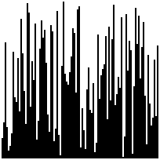

# Laura Sort

We're going to write some sorts! We're going to take those sorts and make animations with them using the provided [render](render) tool.

## Samples

| bubble - 2275 frames | insertion - 2548 frames | merge 539 frames |
| -------------------- | ----------------------- | ---------------- |
|  |  |  |
