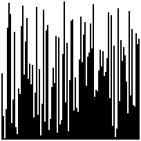
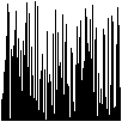
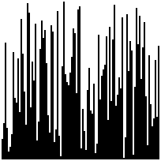

# Sort renderer

Takes in lists of integers and makes them into a GIF animation to show how a sorting algorithm did its thing. The input file format matches Python's default integer list print format. For example, a bubble sort might look like this:

```python
[4, 3, 2, 1]
[3, 4, 2, 1]
[3, 2, 4, 1]
[3, 2, 1, 4]
[2, 3, 1, 4]
[2, 1, 3, 4]
[1, 2, 3, 4]
```

The resulting GIF would be:


All frames are shown for 1/10 sec, though the last frame is shown for 1 second. The lists are represented as bars that are `<scale>` wide and `<scale*value>` high. The scale can be set with the `-s` parameter and defaults to 16.

The resulting GIFs are _not_ optimized. If you want to reduce file sizes, pipe the output through [gifsicle](https://www.lcdf.org/gifsicle/) or similar. The sample above was produced with the following comman:

```bash
go run . -s 32 img/sample.txt | gifsicle -O3 > img/sample.gif
```

## More Examples

These samples were generated

```bash
for x in bubble insertion merge; do
    python3 ./solution/solution.py "$x" -c 100 | \
    go run ./render -d 2 -s 2 | \
    gifsicle -O3 -o render/img/${x}.gif;
done
```

| bubble - 2275 frames | insertion - 2548 frames | merge 539 frames |
| -------------------- | ----------------------- | ---------------- |
|  |  |  |
